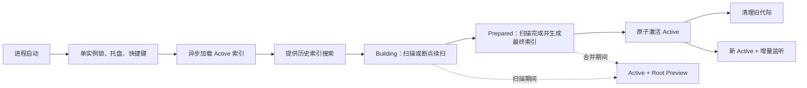

# QuickFox 索引可靠性与性能优化迭代计划

- 目标版本：QuickFox 1.7
- 建议周期：10 个工作日
- 文档日期：2026-08-18
- 迭代主题：索引可靠性与极速启动

## 1. 背景与问题

当前索引链路已经暴露出一组相互影响的问题：

- 约 200 万文件在 Balanced 模式下首次索引需要 10～20 分钟。
- 首次扫描完成进入 `finalizing` 后，已经可搜索的 D 盘结果会暂时消失。
- 重启后能够恢复 D 盘结果，但可能立即再次开始全量索引。
- 多次构建或在最终合并阶段退出后，SQLite 文件持续增长。
- 应用启动时同步恢复完整索引，导致托盘、快捷键和单实例唤醒不能及时可用。
- Windows 同时递归监听磁盘根和嵌套热点目录，事件溢出或单根异常可能触发全盘刷新。
- 设置窗口内容区域存在 `1440 × 960` 最大尺寸，窗口最大化后不能自适应填充。

本迭代不增加新的业务功能，优先解决索引生命周期、启动可用性、存储回收和 Windows 首次索引速度。

## 2. 迭代目标

### 2.1 北极星指标

- 托盘出现时间：P95 不超过 500ms。
- 第二实例唤醒已有进程：P95 不超过 300ms。
- 已有索引时，不因普通启动重新执行全量索引。
- 首次启动后，应用和热点目录在 3 秒内可搜索。
- 200 万 NTFS 文件的快速索引路径目标不超过 90 秒。
- `finalizing` 前后已经发布的搜索结果不消失。
- 连续启动 10 次，完整索引代际只增加一次。
- 连续完整刷新 3 次后，SQLite 稳态体积不超过单份基线的 1.3 倍。
- 在任意索引阶段强制退出，重启后只能继续扫描或继续最终合并，不能无条件从头开始。

### 2.2 本迭代完成标准

迭代完成后，QuickFox 至少应满足：

1. 不重复执行已经完成的磁盘扫描。
2. 应用启动后立即提供托盘和快捷键能力。
3. 首次索引过程中持续提供已经完成范围的搜索结果。
4. 索引构建、最终合并和激活具备崩溃恢复能力。
5. 历史索引批次能够稳定清理，数据库不持续膨胀。
6. Windows NTFS 具备独立快速索引 Adapter，并有明确的通用扫描降级路径。

## 3. 目标架构



### 3.1 索引代际状态

索引批次必须具有明确状态：

- `building`：扫描进行中，保留断点信息，可在重启后继续扫描。
- `prepared`：扫描数据已经完整，等待最终索引构建或激活。
- `active`：当前唯一正式搜索基线。
- `obsolete`：已经被新基线替代，等待安全清理。

启动恢复只能采取以下行为：

- 存在兼容的 `active`：立即加载，不执行全量扫描。
- 存在同配置的 `prepared`：继续最终构建和激活，不重新扫描磁盘。
- 存在同配置的 `building`：从断点继续扫描。
- 不存在任何兼容代际：创建新的全量扫描。

## 4. 工作包

| 工作包           | 优先级 | 主要交付                               | 验收标准                      |
| ---------------- | ------ | -------------------------------------- | ----------------------------- |
| 索引代际原子化   | P0     | 新状态机、原子激活、崩溃恢复           | `finalizing` 强杀后不重新扫描 |
| 搜索连续性       | P0     | 最终索引安装前保留 Root Preview        | D 盘结果全程可搜索            |
| 启动链路拆分     | P0     | 托盘和单实例优先，索引异步恢复         | 200 万索引下托盘不超过 500ms  |
| SQLite 治理      | P0     | 清理未激活批次、旧库回收迁移、空间统计 | 多次刷新后文件不持续增长      |
| Windows 快速扫描 | P0     | NTFS MFT/USN Adapter MVP，通用扫描兜底 | 2M 文件目标不超过 90 秒       |
| Watcher 降级修复 | P1     | 合并嵌套根、局部校准、限制全盘回退     | 溢出只修复对应磁盘或子树      |
| 状态与可观测性   | P1     | 刷新原因、代际、阶段和真实汇总         | 能解释每次自动刷新原因        |
| 设置窗口适配     | P2     | 移除内容区域最大尺寸限制               | 最大化后完整自适应            |

## 5. 实施方案

### 5.1 索引提交与恢复协议

主要涉及：

- `src-tauri/src/core/storage.rs`
- 建议新增 `src-tauri/src/core/index_generation.rs`
- `src-tauri/src/lib.rs` 中的刷新编排和最终切换逻辑

实施要求：

1. 扫描完成后只能把代际转换为 `prepared`，不能立即删除暂存恢复信息。
2. `prepared` 必须包含：
   - 配置指纹；
   - 扫描汇总；
   - 根目录完成状态；
   - directory manifest；
   - 最终索引构建所需的数据版本。
3. 在同一个 SQLite 事务内完成：
   - 写入或确认配置指纹；
   - 写入 manifest；
   - 切换 active baseline；
   - 将旧 active 标记为 obsolete；
   - 更新 runtime generation。
4. 激活成功前不能丢弃 Root Preview 或旧 Active。
5. 激活失败时继续使用旧 Active 和 Root Preview，并把状态标为 degraded。
6. 启动时清理所有没有被 active、building 或 prepared 引用的批次。
7. 数据库最多保留：
   - 一个 active；
   - 一个 building 或 prepared；
   - 必要的增量日志尾部。

### 5.2 搜索连续性与最终切换

当前最终合并开始前会释放各根目录的 Preview，需要调整为：

```text
SearchView = ActiveBaseline + RootPreviews + IncrementalOverlay
```

具体要求：

- 完成一个根目录后立即发布对应 Preview。
- 扫描和最终索引构建期间继续查询 Preview。
- 新索引成功构建后，通过一次短临界区原子交换 Active。
- 交换完成后再释放 Preview。
- 如果最终索引构建失败，Preview 必须继续服务搜索。
- `finalizing` 显示全局汇总，不能展示最后一个小目录遗留的统计。

### 5.3 启动链路拆分

当前完整索引恢复发生在托盘创建之前。目标启动顺序调整为：

1. 获取 single-instance 锁。
2. 创建托盘、全局快捷键和最小 Runtime。
3. 如果是第二实例，立即通知已有实例并退出，不加载 SQLite 全量索引。
4. 主实例在后台线程打开 SQLite 并恢复 Active。
5. 恢复期间先提供应用、历史、计算器、网页搜索和快速目录结果。
6. 完整 Active 准备后原子挂载到查询服务。
7. 后台启动 watcher 和必要的目标校准。

本迭代先完成异步恢复和快速可用。紧凑索引文件持久化或 mmap 可以作为下一迭代独立优化，避免同时重写完整查询结构。

### 5.4 SQLite 空间治理

实施要求：

- 启动恢复时识别并删除未激活的历史 `completed/prepared` 孤儿批次。
- 激活新基线后异步清理 obsolete 批次。
- 检查现有数据库的 `PRAGMA auto_vacuum`。
- 对 `auto_vacuum=NONE` 的旧数据库提供一次性迁移或维护任务。
- 迁移和完整 `VACUUM` 不能阻塞托盘或主窗口。
- 对 WAL 执行有界 checkpoint 和尺寸治理。
- 索引状态中提供以下诊断信息：
  - active generation；
  - building/prepared generation；
  - 每个批次的 entry count；
  - 数据库文件大小；
  - freelist page count；
  - 最近一次 GC 结果。

### 5.5 Windows 快速索引 Adapter

建议新增：

```text
src-tauri/src/core/index_source.rs
src-tauri/src/core/windows_ntfs_index_source.rs
src-tauri/src/core/generic_index_source.rs
```

统一接口只负责产出 `IndexedEntry` 和扫描进度，上层搜索、Provider 和 Action 不感知具体来源。

执行策略：

1. NTFS 固定磁盘优先尝试 MFT/USN 快速路径。
2. 不支持的文件系统、权限不足、网络盘和异常卷使用 Generic Scanner。
3. 应用、桌面、下载等快速目录优先完成和发布。
4. 多个磁盘可以并行，不在同一磁盘内无界并发。
5. 如果父磁盘扫描已经覆盖某热点目录，不能再次把该目录完整写入同一代际。
6. 所有路径经过统一的 Windows 大小写和分隔符规范化。
7. MFT 访问如果需要提升权限或后台服务，必须形成明确的安全与安装方案，禁止静默提权。

本迭代前两天设置技术决策点：

- 如果标准用户权限下的 MFT/USN 路径满足产品要求，完成默认快速路径。
- 如果必须引入高权限服务，则本迭代完成 Adapter、能力探测、真实基准和服务设计文档，同时交付批量 Win32 目录枚举作为无服务优化路径。

### 5.6 Watcher 和增量恢复

- 对 watcher roots 做祖先覆盖压缩：监听 `C:\` 后，不再单独递归监听其下的 Desktop、Downloads 和 Start Menu。
- watcher overflow 只把受影响的根标记为 dirty。
- 优先使用 USN journal 补齐缺失变化。
- USN 不可用时执行目标根校准，不能默认重建所有磁盘。
- watcher 初始化部分失败不能让健康磁盘失效。
- 全量刷新进行期间，普通 DirtyRoots 事件由当前扫描或最终 handoff 吸收，不能无限排队下一轮全量刷新。

### 5.7 状态与 UI

索引状态需要区分：

- `loadingActive`
- `quickAvailable`
- `scanning`
- `prepared`
- `finalizing`
- `ready`
- `degraded`

增加 `refreshReason`：

- `initialBuild`
- `configChanged`
- `preparedResume`
- `buildingResume`
- `watcherOverflow`
- `dirtyRoot`
- `manualRefresh`
- `storageRecovery`

UI 要求：

- “可搜索”必须表示该范围此刻确实位于 SearchView 中。
- finalizing 使用真实全局汇总统计。
- 自动刷新必须显示触发原因。
- 已有 Active 时，后台维护不能使用阻塞性错误提示覆盖正常搜索。
- 设置页面移除 `max-width: 1440px` 和 `max-height: 960px`，设置 Shell 使用窗口可视区域并保留固定边距。

## 6. Subagent 分工

为了降低共享工作区冲突，多个 Subagent 不应同时修改 `src-tauri/src/lib.rs`。

### 6.1 Subagent A：存储与代际状态

负责范围：

- `src-tauri/src/core/storage.rs`
- 新增 `src-tauri/src/core/index_generation.rs`
- schema migration
- 代际状态和原子激活 API
- 孤儿批次清理、GC 和 vacuum
- 存储及崩溃恢复单元测试

限制：不修改 `src-tauri/src/lib.rs` 主流程。

### 6.2 Subagent B：Windows 快速扫描

负责范围：

- 新增 IndexSource 接口
- NTFS MFT/USN 快速路径
- Generic Scanner fallback
- 根目录覆盖去重
- 200 万文件基准工具和结果文档

限制：不修改前端和主启动流程。

### 6.3 Subagent C：前端与状态展示

负责范围：

- `src/App.tsx`
- `src/styles.css`
- `src/tauriClient.ts`
- 对应前端测试
- 新索引阶段和 refreshReason 展示
- 设置窗口自适应

### 6.4 主集成 Agent

独占负责：

- `src-tauri/src/lib.rs`
- 启动顺序调整
- Root Preview 保留和原子切换
- 存储、Scanner 和 UI 状态接口接入
- Watcher 根合并和降级策略
- 端到端回归与最终验收

建议合并顺序：

1. Subagent A：存储状态机和 API。
2. 主集成 Agent：接入生命周期和启动恢复。
3. Subagent B：接入 Windows 快速扫描。
4. 主集成 Agent：完成 Watcher 和调度编排。
5. Subagent C：接入最终状态协议和 UI。
6. 主集成 Agent：运行完整验证并修复集成问题。

## 7. 迭代排期

### 第 1～2 天：基线、接口和决策点

- 固化 200 万文件基准环境和采集指标。
- 增加索引阶段故障注入点。
- 定义 generation schema 和状态迁移。
- 定义 IndexSource 接口。
- 在真实 Windows 机器验证 MFT/USN 权限和性能。

### 第 3～5 天：P0 生命周期和启动修复

- 实现代际状态和原子激活。
- 修复 finalizing 搜索断档。
- 实现 building/prepared 重启恢复。
- 调整单实例、托盘和异步 Active 恢复顺序。
- 实现 SQLite 孤儿批次清理。

### 第 4～7 天：Windows 快速路径

- 实现选定的 Windows 快速枚举路径。
- 接入断点、进度和取消。
- 修复扫描顺序和覆盖根重复扫描。
- 建立 Generic Scanner 降级路径。

### 第 7～8 天：Watcher、状态和 UI

- 合并嵌套 watcher roots。
- 实现局部 dirty-root 恢复。
- 增加 refreshReason 和存储诊断。
- 修复设置窗口响应式布局。

### 第 9～10 天：集成和验收

- 执行故障注入矩阵。
- 执行 Windows 200 万文件真实基准。
- 连续启动、刷新和数据库增长测试。
- 执行完整 Rust、前端和 CI 检查。
- 更新架构、开发和 Windows 手工验收文档。

## 8. 必须增加的测试

### 8.1 生命周期和崩溃恢复

- 在 `building` 中途退出，重启后从断点继续。
- 在 `prepared` 后退出，重启后只执行最终构建。
- 在最终索引构建前后退出，不重新扫描磁盘。
- 在激活事务前后退出，始终只能看到一个有效 Active。
- 激活失败后旧 Active 和 Root Preview 继续可搜索。
- 首次构建中 D 盘结果在 finalizing 前后保持可搜索。

### 8.2 启动和单实例

- 200 万条 Active 存在时，托盘创建不等待完整索引恢复。
- 第二实例不加载完整 SQLite，直接通知已有实例。
- 连续启动 10 次不产生新的全量 generation。
- 配置未变化时不触发 `initialBuild` 或 `configChanged`。

### 8.3 存储

- 启动时清理未引用的 prepared/completed 历史批次。
- 连续三次完整刷新后只保留允许的代际。
- 已有 `auto_vacuum=NONE` 数据库能够迁移或进入后台维护状态。
- GC 失败不破坏 Active，并在状态中保留可诊断信息。
- WAL 和主数据库文件增长有界。

### 8.4 Watcher

- `C:\` 和其下热点目录只注册一个有效递归覆盖关系。
- 超过 8192 个事件时只校准受影响根。
- 单个 watcher 注册失败不影响其他磁盘搜索。
- 活跃全量刷新期间的 dirty 事件不会无限排队下一轮全量刷新。

### 8.5 性能

- 200 万文件首次快速可用时间。
- 200 万文件完整扫描时间。
- Active 恢复时间和托盘出现时间。
- 搜索 P50/P95 延迟。
- 稳态内存和 finalizing 峰值内存。
- 单份 baseline、构建中和 GC 后的 SQLite 大小。

## 9. 验证命令与人工验收

代码完成后至少执行：

```bash
npm run check
npm run rust:test
npm run rust:clippy
```

真实 Windows NTFS 机器需要记录：

- 硬件、Windows 版本、磁盘类型和文件数量。
- 首次快速可用时间。
- 完整索引完成时间。
- 二次启动托盘出现时间。
- 第二实例唤醒时间。
- SQLite 初始、构建中、激活后和 GC 后大小。
- 稳态及峰值内存。
- 在 building、prepared、finalizing 和 activation 阶段强制退出后的恢复结果。

## 10. 本迭代不做

- 不开放第三方插件 API。
- 不扩展新的 Provider 或 Action。
- 不重写排序和查询语法。
- 不扩大全文内容索引范围。
- 不在缺少安全设计时静默安装或运行高权限服务。
- 不同时推进完整 mmap 搜索索引重写；先完成启动异步化和索引生命周期闭环。

## 11. 最终交付物

- 新索引代际状态机及数据库迁移。
- 可崩溃恢复的扫描、最终构建和激活流程。
- 启动即时托盘和异步 Active 恢复。
- Windows 快速扫描 Adapter 及通用降级路径。
- 有界 SQLite 代际与空间治理。
- 局部 Watcher 恢复策略。
- 准确的索引状态 UI 和自适应设置窗口。
- 自动化测试、性能基准和真实 Windows 验收记录。
- 更新后的架构与故障排查文档。
